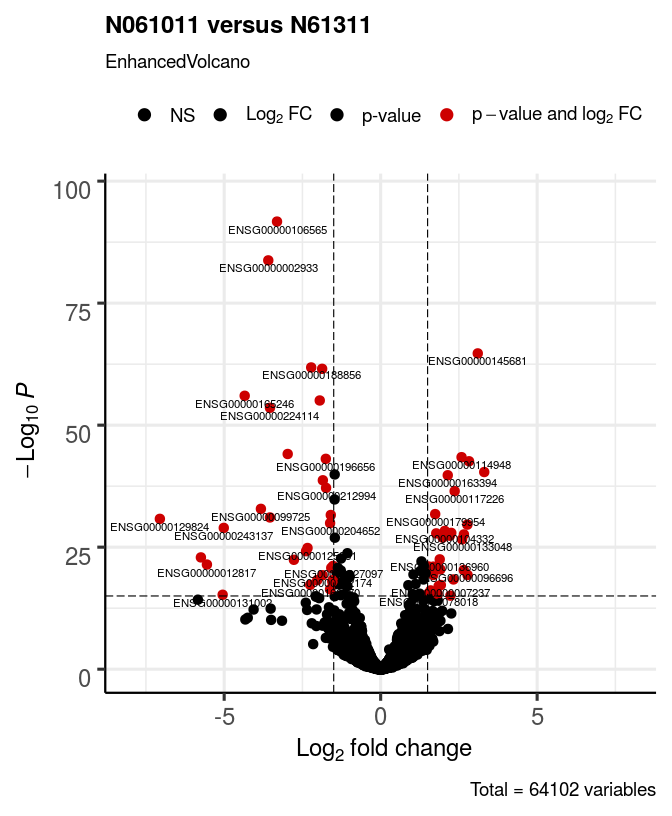
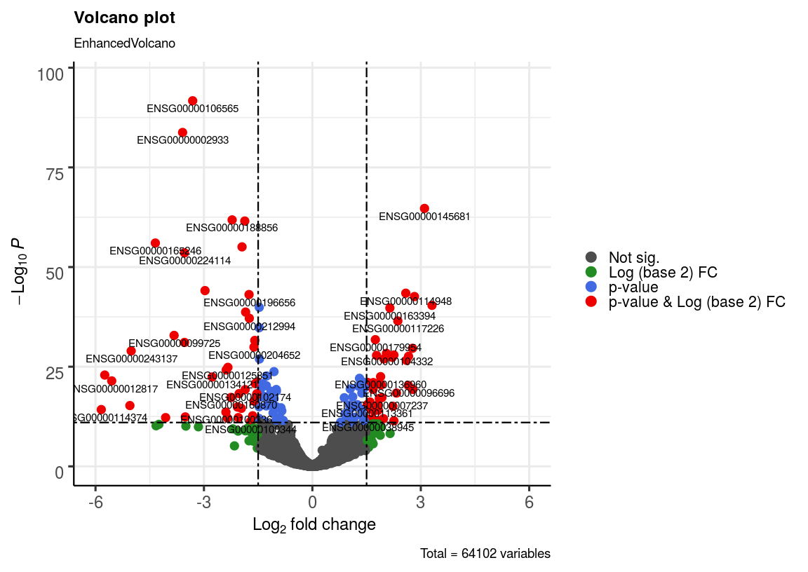
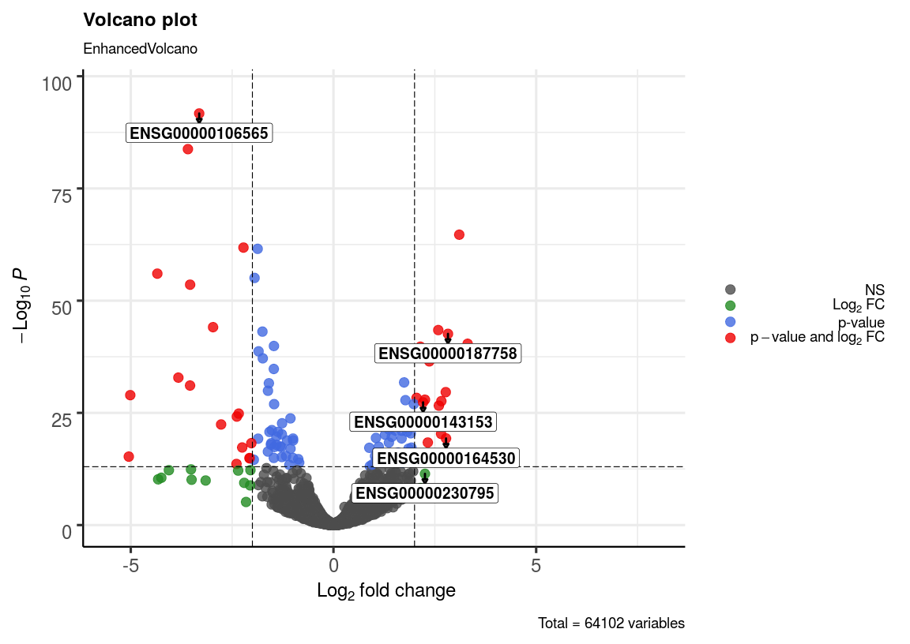
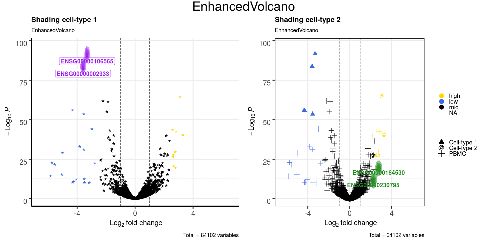
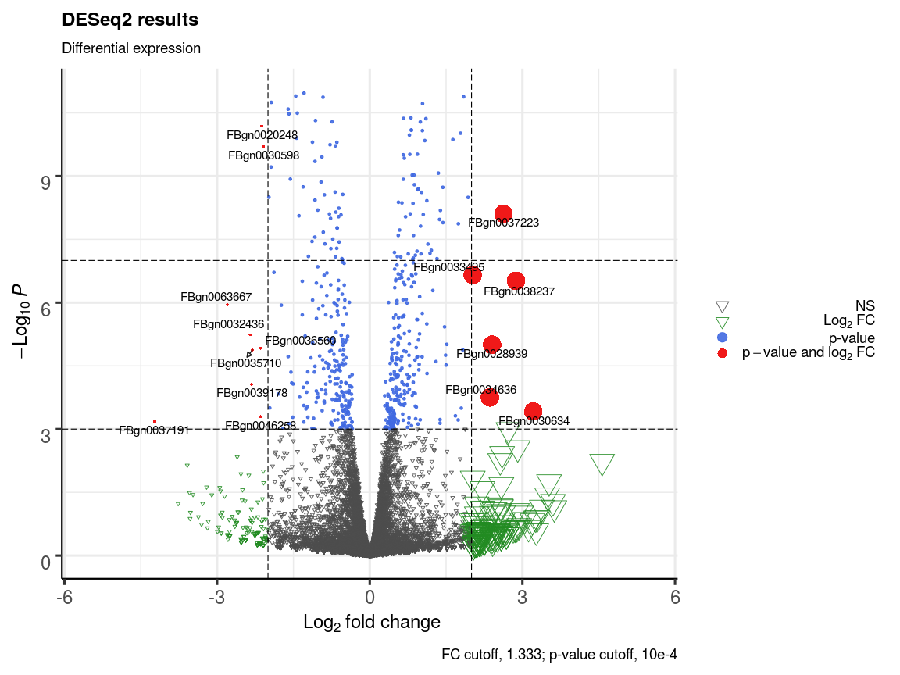
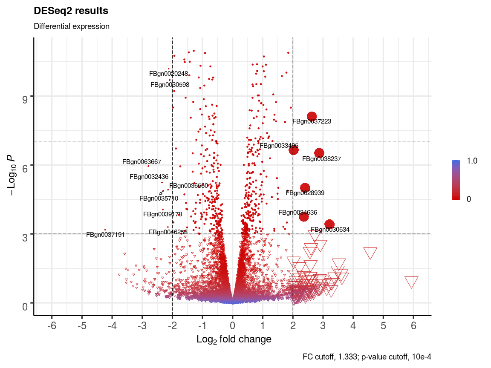

EnhancedVolcano: publication-ready volcano plots with enhanced colouring and labeling
================
Kevin Blighe
2020-01-06

-   [Introduction](#introduction)
-   [Installation](#installation)
    -   [1. Download the package from Bioconductor](#download-the-package-from-bioconductor)
    -   [2. Load the package into R session](#load-the-package-into-r-session)
-   [Quick start](#quick-start)
    -   [Plot the most basic volcano plot](#plot-the-most-basic-volcano-plot)
-   [Advanced features](#advanced-features)
    -   [Modify cut-offs for log2FC and P value; specify title; adjust point and label size](#modify-cut-offs-for-log2fc-and-p-value-specify-title-adjust-point-and-label-size)
    -   [Adjust colour and alpha for point shading](#adjust-colour-and-alpha-for-point-shading)
    -   [Adjust shape of plotted points](#adjust-shape-of-plotted-points)
    -   [Adjust cut-off lines and add extra threshold lines](#adjust-cut-off-lines-and-add-extra-threshold-lines)
    -   [Adjust legend position, size, and text](#adjust-legend-position-size-and-text)
    -   [Fit more labels by adding connectors](#fit-more-labels-by-adding-connectors)
    -   [Only label key variables](#only-label-key-variables)
    -   [Draw labels in boxes](#draw-labels-in-boxes)
    -   [Over-ride colouring scheme with custom key-value pairs](#over-ride-colouring-scheme-with-custom-key-value-pairs)
    -   [Over-ride colour and/or shape scheme with custom key-value pairs](#over-ride-colour-andor-shape-scheme-with-custom-key-value-pairs)
    -   [Shade certain variables](#shade-certain-variables)
    -   [Highlighting key variables via custom point sizes](#highlighting-key-variables-via-custom-point-sizes)
    -   [Custom axis tick marks](#custom-axis-tick-marks)
-   [Acknowledgments](#acknowledgments)
-   [Session info](#session-info)
-   [References](#references)

Introduction
============

Volcano plots represent a useful way to visualise the results of differential expression analyses. Here, we present a highly-configurable function that produces publication-ready volcano plots. EnhancedVolcano (Blighe, Rana, and Lewis 2018) will attempt to fit as many labels in the plot window as possible, thus avoiding 'clogging' up the plot with labels that could not otherwise have been read. Other functionality allows the user to identify up to 3 different types of attributes in the same plot space via colour, shape, size, and shade parameter configurations.

Installation
============

1. Download the package from Bioconductor
-----------------------------------------

``` r
  if (!requireNamespace('BiocManager', quietly = TRUE))
    install.packages('BiocManager')

  BiocManager::install('EnhancedVolcano')
```

Note: to install development version:

``` r
  devtools::install_github('kevinblighe/EnhancedVolcano')
```

2. Load the package into R session
----------------------------------

``` r
  library(EnhancedVolcano)
```

Quick start
===========

For this example, we will follow the tutorial (from Section 3.1) of [RNA-seq workflow: gene-level exploratory analysis and differential expression](http://master.bioconductor.org/packages/release/workflows/vignettes/rnaseqGene/inst/doc/rnaseqGene.html). Specifically, we will load the 'airway' data, where different airway smooth muscle cells were treated with dexamethasone.

``` r
  library(airway)
  library(magrittr)

  data('airway')
  airway$dex %<>% relevel('untrt')
```

Conduct differential expression using DESeq2 in order to create 2 sets of results:

``` r
  library('DESeq2')

  dds <- DESeqDataSet(airway, design = ~ cell + dex)
  dds <- DESeq(dds, betaPrior=FALSE)
  res1 <- results(dds,
    contrast = c('dex','trt','untrt'))
  res1 <- lfcShrink(dds,
    contrast = c('dex','trt','untrt'), res=res1, type = 'normal')
  res2 <- results(dds,
    contrast = c('cell', 'N061011', 'N61311'))
  res2 <- lfcShrink(dds,
    contrast = c('cell', 'N061011', 'N61311'), res=res2, type = 'normal')
```

Plot the most basic volcano plot
--------------------------------

For the most basic volcano plot, only a single data-frame, data-matrix, or tibble of test results is required, containing point labels, log2FC, and adjusted or unadjusted P values. The default cut-off for log2FC is &gt;|2|; the default cut-off for P value is 10e-6.

``` r
  EnhancedVolcano(res1,
    lab = rownames(res1),
    x = 'log2FoldChange',
    y = 'pvalue',
    xlim = c(-5, 8))
```


Advanced features
=================

Virtually all aspects of an EnhancedVolcano plot can be configured for the purposes of accommodating all types of statistical distributions and labelling preferences. By default, EnhancedVolcano will only attempt to label genes that pass the thresholds that you set for statistical significance, i.e., 'pCutoff' and 'FCcutoff'. In addition, it will only label as many of these that can reasonably fit in the plot space. The user can optionally supply a vector of labels (as 'selectLab') that s/he wishes to label in the plot.

Modify cut-offs for log2FC and P value; specify title; adjust point and label size
----------------------------------------------------------------------------------

The default P value cut-off of 10e-6 may be too relaxed for most studies, which may therefore necessitate increasing this threshold by a few orders of magnitude. Equally, the log2FC cut-offs may be too stringent, given that moderated 'shrunk' estimates of log2FC differences in differential expression analysis can now be calculated.

In this example, we also modify the point and label size, which can help to improve clarity where many variables went into the differential expression analysis.

``` r
  EnhancedVolcano(res2,
    lab = rownames(res2),
    x = 'log2FoldChange',
    y = 'pvalue',
    xlim = c(-8, 8),
    title = 'N061011 versus N61311',
    pCutoff = 10e-16,
    FCcutoff = 1.5,
    pointSize = 3.0,
    labSize = 3.0)
```


Adjust colour and alpha for point shading
-----------------------------------------

The default colour scheme may not be to everyone's taste. Here we make it such that only the variables passing both the log2FC and P value thresholds are coloured red, with everything else black. We also adjust the value for 'alpha', which controls the transparency of the plotted points: 1 = 100% opaque; 0 = 100% transparent.

``` r
  EnhancedVolcano(res2,
    lab = rownames(res2),
    x = 'log2FoldChange',
    y = 'pvalue',
    xlim = c(-8, 8),
    title = 'N061011 versus N61311',
    pCutoff = 10e-16,
    FCcutoff = 1.5,
    pointSize = 3.0,
    labSize = 3.0,
    col=c('black', 'black', 'black', 'red3'),
    colAlpha = 1)
```



Adjust shape of plotted points
------------------------------

It can help, visually, to also plot different points as different shapes. The default shape is a circle. The user can specify their own shape encoding via the 'shape' parameter, which accepts either a single or four possible values: if four values, these then map to the standard designation that is also assigned by the colours; if a single value, all points are shaped with this value.

For more information on shape encoding search online at [ggplot2 Quick Reference: shape](http://sape.inf.usi.ch/quick-reference/ggplot2/shape)

``` r
 EnhancedVolcano(res2,
    lab = rownames(res2),
    x = 'log2FoldChange',
    y = 'pvalue',
    xlim = c(-8, 8),
    title = 'N061011 versus N61311',
    pCutoff = 10e-16,
    FCcutoff = 1.5,
    pointSize = 4.0,
    labSize = 3.0,
    shape = 8,
    colAlpha = 1)
```


``` r
  EnhancedVolcano(res2,
    lab = rownames(res2),
    x = 'log2FoldChange',
    y = 'pvalue',
    xlim = c(-8, 8),
    title = 'N061011 versus N61311',
    pCutoff = 10e-16,
    FCcutoff = 1.5,
    pointSize = 3.0,
    labSize = 3.0,
    shape = c(1, 4, 23, 25),
    colAlpha = 1)
```


Adjust cut-off lines and add extra threshold lines
--------------------------------------------------

The lines that are drawn to indicate cut-off points are also modifiable. The parameter 'cutoffLineType' accepts the following values: "blank", "solid", "dashed", "dotted", "dotdash", "longdash", and "twodash". The colour and thickness of these can also be modified with 'cutoffLineCol' and 'cutoffLineWidth'. To disable the lines, set either cutoffLineType="blank" or cutoffLineWidth=0.

Extra lines can also be added via 'hline' and 'vline' to display other cut-offs.

To make these more visible, we will also remove the default gridlines.

``` r
  EnhancedVolcano(res2,
    lab = rownames(res2),
    x = 'log2FoldChange',
    y = 'pvalue',
    xlim = c(-6, 6),
    title = 'N061011 versus N61311',
    pCutoff = 10e-12,
    FCcutoff = 1.5,
    pointSize = 3.0,
    labSize = 3.0,
    colAlpha = 1,
    cutoffLineType = 'blank',
    cutoffLineCol = 'black',
    cutoffLineWidth = 0.8,
    hline = c(10e-12, 10e-36, 10e-60, 10e-84),
    hlineCol = c('grey0', 'grey25','grey50','grey75'),
    hlineType = 'longdash',
    hlineWidth = 0.8,
    gridlines.major = FALSE,
    gridlines.minor = FALSE)
```


Adjust legend position, size, and text
--------------------------------------

The position of the legend can also be changed to "left" or "right" (and stacked vertically), or 'top' or "bottom" (stacked horizontally). The legend text, label size, and icon size can also be modified.

``` r
  EnhancedVolcano(res2,
    lab = rownames(res2),
    x = 'log2FoldChange',
    y = 'pvalue',
    xlim = c(-6, 6),
    pCutoff = 10e-12,
    FCcutoff = 1.5,
    cutoffLineType = 'twodash',
    cutoffLineWidth = 0.8,
    pointSize = 4.0,
    labSize = 4.0,
    colAlpha = 1,
    legendLabels=c('Not sig.','Log (base 2) FC','p-value',
      'p-value & Log (base 2) FC'),
    legendPosition = 'right',
    legendLabSize = 16,
    legendIconSize = 5.0)
```



Note: to make the legend completely invisible, specify:

``` r
legendPosition = 'none'
```

Fit more labels by adding connectors
------------------------------------

In order to maximise free space in the plot window, one can fit more labels by adding connectors from labels to points, where appropriate. The width and colour of these connectors can also be modified with 'widthConnectors' and 'colConnectors', respectively. Further configuration is achievable via 'typeConnectors' ("open", "closed"), 'endsConnectors' ("last", "first", "both"), and lengthConnectors (default = unit(0.01, 'npc')).

The result may not always be desirable as it can make the plot look overcrowded.

``` r
  EnhancedVolcano(res2,
    lab = rownames(res2),
    x = 'log2FoldChange',
    y = 'pvalue',
    xlim = c(-6,6),
    xlab = bquote(~Log[2]~ 'fold change'),
    pCutoff = 10e-14,
    FCcutoff = 2.0,
    pointSize = 4.0,
    labSize = 4.0,
    colAlpha = 1,
    legendPosition = 'right',
    legendLabSize = 12,
    legendIconSize = 4.0,
    drawConnectors = TRUE,
    widthConnectors = 0.2,
    colConnectors = 'grey30')
```


Only label key variables
------------------------

In many situations, people may only wish to label their key variables / variables of interest. One can therefore supply a vector of these variables via the 'selectLab' parameter, the contents of which have to also be present in the vector passed to 'lab'. In addition, only those variables that pass both the cutoff for log2FC and P value will be labelled.

``` r
  EnhancedVolcano(res2,
    lab = rownames(res2),
    x = 'log2FoldChange',
    y = 'pvalue',
    selectLab = c('ENSG00000106565','ENSG00000187758'),
    xlim = c(-6,7),
    xlab = bquote(~Log[2]~ 'fold change'),
    pCutoff = 10e-14,
    FCcutoff = 2.0,
    pointSize = 4.0,
    labSize = 5.0,
    shape = c(4, 35, 17, 18),
    colAlpha = 1,
    legendPosition = 'right',
    legendLabSize = 14,
    legendIconSize = 5.0)
```


Draw labels in boxes
--------------------

To improve label clarity, we can draw simple boxes around the plots labels. This works much better when drawConnectors is also TRUE.

``` r
  EnhancedVolcano(res2,
    lab = rownames(res2),
    x = 'log2FoldChange',
    y = 'pvalue',
    selectLab = c('ENSG00000106565','ENSG00000187758',
      'ENSG00000230795', 'ENSG00000164530',
      'ENSG00000143153'),
    xlim = c(-5.5,8),
    xlab = bquote(~Log[2]~ 'fold change'),
    pCutoff = 10e-14,
    FCcutoff = 2.0,
    pointSize = 4.0,
    labSize = 5.0,
    labCol = 'black',
    labFace = 'bold',
    boxedLabels = TRUE,
    colAlpha = 4/5,
    legendPosition = 'right',
    legendLabSize = 14,
    legendIconSize = 4.0,
    drawConnectors = TRUE,
    widthConnectors = 1.0,
    colConnectors = 'black')
```



Over-ride colouring scheme with custom key-value pairs
------------------------------------------------------

In certain situations, one may wish to over-ride the default colour scheme with their own colour-scheme, such as colouring variables by pathway, cell-type or group. This can be achieved by supplying a named vector as 'colCustom'.

In this example, we just wish to colour all variables with log2FC &gt; 2.5 as 'high' and those with log2FC &lt; -2.5 as 'low'.

``` r
  # create custom key-value pairs for 'high', 'low', 'mid' expression by fold-change
  # this can be achieved with nested ifelse statements
  keyvals <- ifelse(
    res2$log2FoldChange < -2.5, 'royalblue',
      ifelse(res2$log2FoldChange > 2.5, 'gold',
        'black'))
  names(keyvals)[keyvals == 'gold'] <- 'high'
  names(keyvals)[keyvals == 'black'] <- 'mid'
  names(keyvals)[keyvals == 'royalblue'] <- 'low'
```

``` r
  p1 <- EnhancedVolcano(res2,
    lab = rownames(res2),
    x = 'log2FoldChange',
    y = 'pvalue',
    selectLab = rownames(res2)[which(names(keyvals) %in% c('high', 'low'))],
    xlim = c(-6.5,6.5),
    xlab = bquote(~Log[2]~ 'fold change'),
    title = 'Custom colour over-ride',
    pCutoff = 10e-14,
    FCcutoff = 1.0,
    pointSize = 4.5,
    labSize = 4.5,
    shape = c(6, 4, 2, 11),
    colCustom = keyvals,
    colAlpha = 1,
    legendPosition = 'left',
    legendLabSize = 15,
    legendIconSize = 5.0,
    drawConnectors = TRUE,
    widthConnectors = 0.5,
    colConnectors = 'grey50',
    gridlines.major = TRUE,
    gridlines.minor = FALSE,
    border = 'partial',
    borderWidth = 1.5,
    borderColour = 'black')

  p2 <- EnhancedVolcano(res2,
    lab = rownames(res2),
    x = 'log2FoldChange',
    y = 'pvalue',
    selectLab = rownames(res2)[which(names(keyvals) %in% c('high', 'low'))],
    xlim = c(-6.5,6.5),
    xlab = bquote(~Log[2]~ 'fold change'),
    title = 'No custom colour over-ride',
    pCutoff = 10e-14,
    FCcutoff = 1.0,
    pointSize = 4.5,
    labSize = 4.5,
    colCustom = NULL,
    colAlpha = 1,
    legendPosition = 'right',
    legendLabSize = 15,
    legendIconSize = 5.0,
    drawConnectors = FALSE,
    widthConnectors = 0.5,
    colConnectors = 'grey50',
    gridlines.major = TRUE,
    gridlines.minor = FALSE,
    border = 'full',
    borderWidth = 1.0,
    borderColour = 'black')

  library(gridExtra)
  library(grid)
  grid.arrange(p1, p2,
    ncol=2,
    top = textGrob('EnhancedVolcano',
      just = c('center'),
      gp = gpar(fontsize = 32)))
```


Over-ride colour and/or shape scheme with custom key-value pairs
----------------------------------------------------------------

In this example, we first over-ride the existing shape scheme and then both the colour and shape scheme at the same time.

``` r
  # define different cell-types that will be shaded
  celltype1 <- c('ENSG00000106565', 'ENSG00000002933',
    'ENSG00000165246', 'ENSG00000224114')
  celltype2 <- c('ENSG00000230795', 'ENSG00000164530',
    'ENSG00000143153', 'ENSG00000169851',
    'ENSG00000231924', 'ENSG00000145681')

  # create custom key-value pairs for different cell-types
  # this can be achieved with nested ifelse statements
  keyvals.shape <- ifelse(
    rownames(res2) %in% celltype1, 17,
      ifelse(rownames(res2) %in% celltype2, 64,
        3))
  names(keyvals.shape)[keyvals.shape == 3] <- 'PBMC'
  names(keyvals.shape)[keyvals.shape == 17] <- 'Cell-type 1'
  names(keyvals.shape)[keyvals.shape == 64] <- 'Cell-type 2'
```

``` r
  p1 <- EnhancedVolcano(res2,
    lab = rownames(res2),
    x = 'log2FoldChange',
    y = 'pvalue',
    selectLab = rownames(res2)[which(names(keyvals) %in% c('high', 'low'))],
    xlim = c(-6.5,6.5),
    xlab = bquote(~Log[2]~ 'fold change'),
    title = 'Custom shape over-ride',
    pCutoff = 10e-14,
    FCcutoff = 1.0,
    pointSize = 4.5,
    labSize = 4.5,
    shapeCustom = keyvals.shape,
    colCustom = NULL,
    colAlpha = 1,
    legendLabSize = 15,
    legendPosition = 'left',
    legendIconSize = 5.0,
    drawConnectors = TRUE,
    widthConnectors = 0.5,
    colConnectors = 'grey50',
    gridlines.major = TRUE,
    gridlines.minor = FALSE,
    border = 'partial',
    borderWidth = 1.5,
    borderColour = 'black')

  # create custom key-value pairs for 'high', 'low', 'mid' expression by fold-change
  # this can be achieved with nested ifelse statements
  keyvals.colour <- ifelse(
    res2$log2FoldChange < -2.5, 'royalblue',
      ifelse(res2$log2FoldChange > 2.5, 'gold',
        'black'))
  names(keyvals.colour)[keyvals.colour == 'gold'] <- 'high'
  names(keyvals.colour)[keyvals.colour == 'black'] <- 'mid'
  names(keyvals.colour)[keyvals.colour == 'royalblue'] <- 'low'

  p2 <- EnhancedVolcano(res2,
    lab = rownames(res2),
    x = 'log2FoldChange',
    y = 'pvalue',
    selectLab = rownames(res2)[which(names(keyvals) %in% c('High', 'Low'))],
    xlim = c(-6.5,6.5),
    xlab = bquote(~Log[2]~ 'fold change'),
    title = 'Custom shape & colour over-ride',
    pCutoff = 10e-14,
    FCcutoff = 1.0,
    pointSize = 5.5,
    labSize = 0.0,
    shapeCustom = keyvals.shape,
    colCustom = keyvals.colour,
    colAlpha = 1,
    legendPosition = 'right',
    legendLabSize = 15,
    legendIconSize = 5.0,
    drawConnectors = TRUE,
    widthConnectors = 0.5,
    colConnectors = 'grey50',
    gridlines.major = TRUE,
    gridlines.minor = FALSE,
    border = 'full',
    borderWidth = 1.0,
    borderColour = 'black')

  library(gridExtra)
  library(grid)
  grid.arrange(p1, p2,
    ncol=2,
    top = textGrob('EnhancedVolcano',
      just = c('center'),
      gp = gpar(fontsize = 32)))
```


Shade certain variables
-----------------------

In this example we add an extra level of highlighting key variables by shading.

This feature works best for shading just 1 or 2 key variables. It is expected that the user can use the 'shapeCustom' parameter for more in depth identification of different types of variables.

``` r
  # define different cell-types that will be shaded
  celltype1 <- c('ENSG00000106565', 'ENSG00000002933')
  celltype2 <- c('ENSG00000230795', 'ENSG00000164530')
```

``` r
  p1 <- EnhancedVolcano(res2,
    lab = rownames(res2),
    x = 'log2FoldChange',
    y = 'pvalue',
    selectLab = celltype1,
    xlim = c(-6.5,6.5),
    xlab = bquote(~Log[2]~ 'fold change'),
    title = 'Shading cell-type 1',
    pCutoff = 10e-14,
    FCcutoff = 1.0,
    pointSize = 8.0,
    labSize = 5.0,
    labCol = 'purple',
    labFace = 'bold',
    boxedLabels = TRUE,
    shape = 42,
    colCustom = keyvals,
    colAlpha = 1,
    legendPosition = 'none',
    legendLabSize = 15,
    legendIconSize = 5.0,
    shade = celltype1,
    shadeLabel = 'Cell-type I',
    shadeAlpha = 1/2,
    shadeFill = 'purple',
    shadeSize = 4,
    shadeBins = 5,
    drawConnectors = TRUE,
    widthConnectors = 1.0,
    colConnectors = 'grey30',
    gridlines.major = TRUE,
    gridlines.minor = FALSE,
    border = 'partial',
    borderWidth = 1.5,
    borderColour = 'black')

  p2 <- EnhancedVolcano(res2,
    lab = rownames(res2),
    x = 'log2FoldChange',
    y = 'pvalue',
    selectLab = celltype2,
    xlim = c(-6.5,6.5),
    xlab = bquote(~Log[2]~ 'fold change'),
    title = 'Shading cell-type 2',
    pCutoff = 10e-14,
    FCcutoff = 1.0,
    labSize = 5.0,
    labCol = 'forestgreen',
    labFace = 'bold',
    shapeCustom = keyvals.shape,
    colCustom = keyvals.colour,
    colAlpha = 1,
    legendPosition = 'right',
    pointSize = 4.0,
    legendLabSize = 15,
    legendIconSize = 5.0,
    shade = celltype2,
    shadeLabel = 'Cell-type II',
    shadeAlpha = 1/2,
    shadeFill = 'forestgreen',
    shadeSize = 1,
    shadeBins = 5,
    drawConnectors = TRUE,
    widthConnectors = 1.0,
    colConnectors = 'grey30',
    gridlines.major = TRUE,
    gridlines.minor = FALSE,
    border = 'full',
    borderWidth = 1.0,
    borderColour = 'black')

  library(gridExtra)
  library(grid)
  grid.arrange(p1, p2,
    ncol=2,
    top = textGrob('EnhancedVolcano',
      just = c('center'),
      gp = gpar(fontsize = 32)))
```



Highlighting key variables via custom point sizes
-------------------------------------------------

One can also supply a vector of sizes to pointSize for the purpose of having a different size for each poin. For example, if we want to change the size of just those variables with log<sub>2</sub>FC&gt;2:

``` r
  library("pasilla")
  pasCts <- system.file("extdata", "pasilla_gene_counts.tsv",
    package="pasilla", mustWork=TRUE)
  pasAnno <- system.file("extdata", "pasilla_sample_annotation.csv",
    package="pasilla", mustWork=TRUE)
  cts <- as.matrix(read.csv(pasCts,sep="\t",row.names="gene_id"))
  coldata <- read.csv(pasAnno, row.names=1)
  coldata <- coldata[,c("condition","type")]
  rownames(coldata) <- sub("fb", "", rownames(coldata))
  cts <- cts[, rownames(coldata)]
  library("DESeq2")
  dds <- DESeqDataSetFromMatrix(countData = cts,
    colData = coldata,
    design = ~ condition)

  featureData <- data.frame(gene=rownames(cts))
  mcols(dds) <- DataFrame(mcols(dds), featureData)
  dds <- DESeq(dds)
  res <- results(dds)

  p1 <- EnhancedVolcano(res,
    lab = rownames(res),
    x = "log2FoldChange",
    y = "pvalue",
    pCutoff = 10e-4,
    FCcutoff = 2,
    xlim = c(-5.5, 5.5),
    ylim = c(0, -log10(10e-12)),
    pointSize = c(ifelse(res$log2FoldChange>2, 8, 1)),
    labSize = 4.0,
    shape = c(6, 6, 19, 16),
    title = "DESeq2 results",
    subtitle = "Differential expression",
    caption = "FC cutoff, 1.333; p-value cutoff, 10e-4",
    legendPosition = "right",
    legendLabSize = 14,
    col = c("grey30", "forestgreen", "royalblue", "red2"),
    colAlpha = 0.9,
    drawConnectors = TRUE,
    hline = c(10e-8),
    widthConnectors = 0.5)

  p1
```



Custom axis tick marks
----------------------

Custom axis ticks can be added in a 'plug and play' fashion via *ggplot2* functionality, as follows:

``` r
  p1 +
    ggplot2::coord_cartesian(xlim=c(-6, 6)) +
    ggplot2::scale_x_continuous(
      breaks=seq(-6,6, 1))
```



More information on this can be found here: <http://www.sthda.com/english/wiki/ggplot2-axis-ticks-a-guide-to-customize-tick-marks-and-labels>

Acknowledgments
===============

The development of *EnhancedVolcano* has benefited from contributions and suggestions from:

-   Sharmila Rana
-   [Myles Lewis](https://www.qmul.ac.uk/whri/people/academic-staff/items/lewismyles.html)
-   Luke Dow (Assistant Professor at Weill Cornell Medicine)
-   Tokhir Dadaev (Institute of Cancer Research)
-   Alina Frolova
-   Venu Thatikonda (Deutsches Krebsforschungszentrum (DKFZ) / German Cancer Research Center)
-   David Wheeler (Montana State University)
-   David Kulp

Session info
============

``` r
sessionInfo()
```

    ## R version 3.6.2 (2019-12-12)
    ## Platform: x86_64-pc-linux-gnu (64-bit)
    ## Running under: Ubuntu 16.04.6 LTS
    ## 
    ## Matrix products: default
    ## BLAS:   /usr/lib/atlas-base/atlas/libblas.so.3.0
    ## LAPACK: /usr/lib/atlas-base/atlas/liblapack.so.3.0
    ## 
    ## locale:
    ##  [1] LC_CTYPE=pt_BR.UTF-8       LC_NUMERIC=C              
    ##  [3] LC_TIME=en_GB.UTF-8        LC_COLLATE=pt_BR.UTF-8    
    ##  [5] LC_MONETARY=en_GB.UTF-8    LC_MESSAGES=pt_BR.UTF-8   
    ##  [7] LC_PAPER=en_GB.UTF-8       LC_NAME=C                 
    ##  [9] LC_ADDRESS=C               LC_TELEPHONE=C            
    ## [11] LC_MEASUREMENT=en_GB.UTF-8 LC_IDENTIFICATION=C       
    ## 
    ## attached base packages:
    ##  [1] grid      parallel  stats4    stats     graphics  grDevices utils    
    ##  [8] datasets  methods   base     
    ## 
    ## other attached packages:
    ##  [1] pasilla_1.14.0              gridExtra_2.3              
    ##  [3] DESeq2_1.26.0               magrittr_1.5               
    ##  [5] airway_1.6.0                SummarizedExperiment_1.16.0
    ##  [7] DelayedArray_0.12.0         BiocParallel_1.20.0        
    ##  [9] matrixStats_0.55.0          Biobase_2.46.0             
    ## [11] GenomicRanges_1.38.0        GenomeInfoDb_1.22.0        
    ## [13] IRanges_2.20.0              S4Vectors_0.24.0           
    ## [15] BiocGenerics_0.32.0         EnhancedVolcano_1.5.1      
    ## [17] ggrepel_0.8.1               ggplot2_3.2.1              
    ## [19] knitr_1.26                 
    ## 
    ## loaded via a namespace (and not attached):
    ##  [1] bit64_0.9-7            splines_3.6.2          Formula_1.2-3         
    ##  [4] assertthat_0.2.1       highr_0.8              latticeExtra_0.6-28   
    ##  [7] blob_1.2.0             GenomeInfoDbData_1.2.2 yaml_2.2.0            
    ## [10] RSQLite_2.1.2          pillar_1.4.2           backports_1.1.5       
    ## [13] lattice_0.20-38        glue_1.3.1             digest_0.6.22         
    ## [16] RColorBrewer_1.1-2     XVector_0.26.0         checkmate_1.9.4       
    ## [19] colorspace_1.4-1       htmltools_0.4.0        Matrix_1.2-17         
    ## [22] XML_3.98-1.20          pkgconfig_2.0.3        genefilter_1.68.0     
    ## [25] zlibbioc_1.32.0        purrr_0.3.3            xtable_1.8-4          
    ## [28] scales_1.0.0           tibble_2.1.3           htmlTable_1.13.2      
    ## [31] annotate_1.64.0        withr_2.1.2            nnet_7.3-12           
    ## [34] lazyeval_0.2.2         survival_3.1-7         crayon_1.3.4          
    ## [37] memoise_1.1.0          evaluate_0.14          MASS_7.3-51.4         
    ## [40] foreign_0.8-72         tools_3.6.2            data.table_1.12.6     
    ## [43] stringr_1.4.0          locfit_1.5-9.1         munsell_0.5.0         
    ## [46] cluster_2.1.0          AnnotationDbi_1.48.0   compiler_3.6.2        
    ## [49] rlang_0.4.1            RCurl_1.95-4.12        rstudioapi_0.10       
    ## [52] htmlwidgets_1.5.1      labeling_0.3           bitops_1.0-6          
    ## [55] base64enc_0.1-3        rmarkdown_1.17         gtable_0.3.0          
    ## [58] DBI_1.0.0              R6_2.4.1               dplyr_0.8.3           
    ## [61] zeallot_0.1.0          bit_1.1-14             Hmisc_4.3-0           
    ## [64] stringi_1.4.3          Rcpp_1.0.3             geneplotter_1.64.0    
    ## [67] vctrs_0.2.0            rpart_4.1-15           acepack_1.4.1         
    ## [70] tidyselect_0.2.5       xfun_0.11

References
==========

Blighe, K, S Rana, and M Lewis. 2018. “EnhancedVolcano: Publication-ready volcano plots with enhanced colouring and labeling.” <https://github.com/kevinblighe>.
